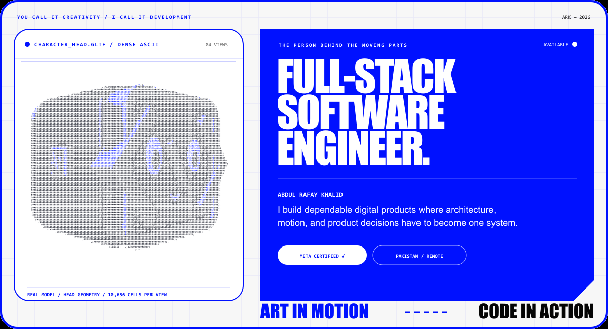

<picture>
  <source media="(max-width: 680px)" srcset="./assets/profile-hero-mobile.webp" />
  
</picture>

 
 

  
  
  
  

 

<picture>
  <source media="(max-width: 680px)" srcset="./assets/about-mobile.svg" />
  
</picture>

<picture>
  <source media="(max-width: 680px)" srcset="./assets/stack-mobile.svg" />
  
</picture>

<picture>
  <source media="(max-width: 680px)" srcset="./assets/certifications-mobile.svg" />
  
</picture>

<picture>
  <source media="(max-width: 680px)" srcset="./assets/telemetry-mobile.svg" />
  
</picture>

<!-- 

  

 -->

  

  

<picture>
  <source media="(max-width: 680px)" srcset="./assets/snake-heading-mobile.svg" />
  
</picture>

<picture>
  <source media="(prefers-color-scheme: dark)" srcset="https://raw.githubusercontent.com/ARafaykhalid/ARafaykhalid/output/github-snake-blue-dark.svg" />
  <source media="(prefers-color-scheme: light)" srcset="https://raw.githubusercontent.com/ARafaykhalid/ARafaykhalid/output/github-snake-blue.svg" />
  
</picture>

 
 

<a href="mailto:abdulrafaykhalidjameel@gmail.com">
  <picture>
    <source media="(max-width: 680px)" srcset="./assets/contact-mobile.svg" />
    
  </picture>
</a>

  
  

<!-- 
HUMAN-WRITTEN SOFTWARE / MACHINE-ASSISTED CHAOS / CAREFULLY HANDLED IN PRODUCTION
 -->
